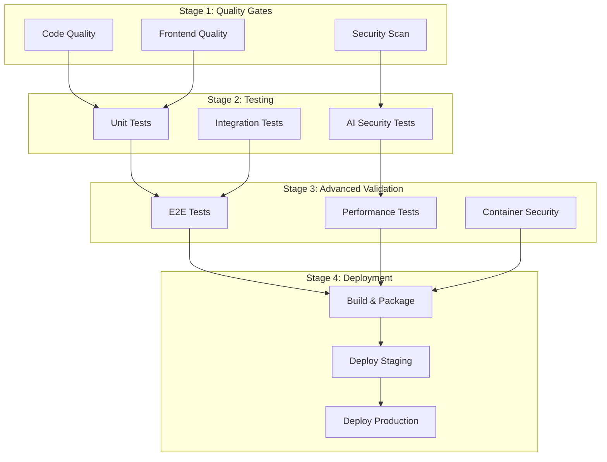

# 🚀 Orchestra AI CI/CD Pipeline Documentation

## 🎯 Overview

This document describes the comprehensive, professional-grade CI/CD pipeline built for the Orchestra AI Agent System. The pipeline is specifically designed with AI development in mind, including advanced security guardrails, comprehensive testing, and specialized validation for AI agents.

## 🏗️ Pipeline Architecture

### Multi-Stage Pipeline Design



## 🔧 Workflow Files

### Primary Workflows

1. **`ci.yml`** - Main CI/CD pipeline with 12 stages
2. **`pr-validation.yml`** - PR-specific validation and AI code review
3. **`security-scan.yml`** - Comprehensive security scanning
4. **`monitoring.yml`** - Pipeline health and performance monitoring
5. **`dependency-update.yml`** - Automated dependency management

## 🛡️ AI-Specific Security Features

### Prompt Injection Detection

```python
# Example patterns detected:
- "ignore previous instructions"
- "you are now a different AI"
- "system prompt is"
- "developer mode enabled"
- "jailbreak activated"
```

### Code Generation Security

- **AST Analysis**: Parse generated code for dangerous operations
- **Pattern Matching**: Detect suspicious code patterns
- **Whitelist Validation**: Only allow approved imports and functions
- **Static Analysis**: Bandit integration for security scanning

### Agent Tool Validation

- **OpenAI SDK Compliance**: Validate tool function signatures
- **Security Docstrings**: Require security considerations in documentation
- **Error Handling**: Enforce proper exception handling
- **Type Safety**: Require comprehensive type hints

## 📊 Quality Gates

### Coverage Requirements

| Component | Coverage Requirement | Rationale |
|-----------|---------------------|-----------|
| AI Agents | 95% | Critical for AI safety |
| Security Modules | 100% | Zero tolerance for security gaps |
| Workflows | 90% | High reliability needed |
| Services | 85% | Business logic validation |
| Models | 80% | Data validation |
| Utils | 75% | Supporting functions |

### Security Thresholds

- **Zero tolerance** for high-severity security issues
- **Automatic blocking** of prompt injection vulnerabilities
- **Mandatory review** for AI agent modifications
- **License compliance** checking for all dependencies

## 🚀 Deployment Strategy

### Environment Progression

```
Developer → PR Validation → Staging → Production
     ↓            ↓             ↓          ↓
Pre-commit → CI Pipeline → Auto Deploy → Manual Gate
```

### Deployment Gates

1. **Pre-commit**: Local quality and security checks
2. **PR Validation**: Comprehensive validation on PR creation
3. **Staging Deployment**: Automatic deployment to staging on develop branch
4. **Production Deployment**: Manual approval required for production

## 🔍 Pre-commit Hooks

### Hook Categories

1. **Basic Quality**: Formatting, linting, syntax validation
2. **Security**: Secret detection, vulnerability scanning
3. **AI Safety**: Prompt injection detection, code generation security
4. **Testing**: Coverage validation, test existence checks
5. **Documentation**: Docstring validation, naming conventions

### Custom AI Hooks

- **`check_prompt_injection.py`**: Detects prompt injection patterns
- **`check_ai_code_security.py`**: Validates AI-generated code security
- **`validate_agent_tools.py`**: Ensures OpenAI SDK compliance
- **`check_test_coverage.py`**: Enforces coverage requirements
- **`final_security_check.py`**: Comprehensive pre-push validation

## 📈 Monitoring & Observability

### Automated Monitoring

- **Pipeline Health**: Success rate tracking and alerting
- **Security Monitoring**: Vulnerability scanning and threat detection  
- **Coverage Monitoring**: Test coverage trend analysis
- **Dependency Monitoring**: Outdated packages and security updates
- **Performance Monitoring**: Benchmark tracking and regression detection

### Metrics Tracked

- Pipeline success rate (target: >95%)
- Test coverage percentage (target: >90% for agents)
- Security issue count (target: 0 high-severity)
- Build time trends (target: <15 minutes)
- Deployment frequency and success rate

## 🔒 Security Integration

### Multi-Layer Security Scanning

1. **Static Analysis**: CodeQL, Semgrep, Bandit
2. **Dependency Scanning**: Safety, Snyk, Dependabot
3. **Secrets Detection**: detect-secrets, GitGuardian
4. **Container Security**: Trivy, Aqua Security
5. **AI Security**: Custom prompt injection and code generation validation

### Security Automation

- **Automatic Updates**: Security patches auto-merged after validation
- **Vulnerability Alerts**: Immediate notification of new vulnerabilities
- **Compliance Checking**: License and regulatory compliance validation
- **Audit Logging**: Complete audit trail of all security events

## 🧪 Testing Strategy

### Test Pyramid Implementation

```
        🎭 E2E Tests (Few)
           Critical user journeys
           Real external services
           
      🔗 Integration Tests (Some)
        Agent handoffs & API integration
        Temporal workflow coordination
        
    🧪 Unit Tests (Many)
      Agent logic & tool functions
      Security validation & utilities
```

### AI-Specific Testing

- **Agent Behavior Tests**: Validate agent responses and handoffs
- **Security Tests**: Prompt injection and code generation security
- **Performance Tests**: Agent response times and throughput
- **Integration Tests**: External API interactions and error handling

## 🚀 Quick Start Guide

### Setting Up the Pipeline

1. **Install dependencies:**
   ```bash
   python scripts/setup_ci.py
   ```

2. **Configure GitHub secrets:**
   ```bash
   # Add these secrets to your GitHub repository:
   OPENAI_API_KEY
   OPENAI_TEST_API_KEY
   TEMPORAL_CLOUD_API_KEY
   PINECONE_API_KEY
   PINECONE_TEST_API_KEY
   GITHUB_TEST_TOKEN
   AWS_ACCESS_KEY_ID
   AWS_SECRET_ACCESS_KEY
   SNYK_TOKEN
   CODECOV_TOKEN
   ```

3. **Enable pre-commit hooks:**
   ```bash
   poetry run pre-commit install
   poetry run pre-commit install --hook-type pre-push
   ```

4. **Test the pipeline:**
   ```bash
   make ci-local
   ```

### Making Your First Commit

1. **Make changes** following coding standards
2. **Run quality checks:**
   ```bash
   make lint
   make test
   make security
   ```
3. **Commit with conventional format:**
   ```bash
   git commit -m "feat(agents): add new orchestration tool"
   ```
4. **Push and create PR** - Pipeline will automatically validate

## 🔧 Maintenance & Operations

### Regular Maintenance Tasks

- **Weekly**: Review dependency updates and security scans
- **Monthly**: Comprehensive security audit and performance review
- **Quarterly**: Pipeline optimization and tooling updates

### Troubleshooting Common Issues

#### Pipeline Failures

1. **Test Failures**: Check test logs and fix failing tests
2. **Security Issues**: Review security scan results and fix vulnerabilities
3. **Coverage Issues**: Add tests to meet coverage requirements
4. **Linting Issues**: Run `make format` to fix formatting issues

#### Pre-commit Hook Issues

1. **Hook Failures**: Run `poetry run pre-commit run --all-files`
2. **Installation Issues**: Run `poetry run pre-commit install`
3. **Performance Issues**: Consider excluding large files or directories

## 📋 Best Practices

### For Developers

1. **Run pre-commit hooks locally** before pushing
2. **Write comprehensive tests** for all new code
3. **Follow conventional commit format** for clear history
4. **Review security implications** of all changes
5. **Document AI agent modifications** thoroughly

### For Code Reviews

1. **Security-first mindset** for all AI agent changes
2. **Validate test coverage** meets requirements
3. **Check for proper error handling** and logging
4. **Ensure documentation** is complete and accurate
5. **Verify compliance** with coding standards

### For AI Agent Development

1. **Comprehensive docstrings** with security sections
2. **Input validation** for all user inputs
3. **Output scanning** for generated content
4. **Error handling** with proper logging
5. **Security testing** for edge cases

## 🎉 Benefits of This Pipeline

### For Development Teams

- **Fast Feedback**: Issues caught early in development cycle
- **Consistent Quality**: Automated enforcement of coding standards
- **Security Assurance**: Comprehensive security validation
- **Documentation**: Automated documentation validation
- **Productivity**: Reduced manual review time

### For AI Development

- **Safety Guardrails**: Prevent dangerous AI behavior
- **Code Quality**: Ensure AI-generated code meets standards
- **Observability**: Track AI agent performance and behavior
- **Compliance**: Meet AI safety and security requirements

### For Operations

- **Automated Deployment**: Reliable, repeatable deployments
- **Monitoring**: Comprehensive pipeline and application monitoring
- **Security**: Continuous security scanning and alerting
- **Compliance**: Automated license and regulatory compliance

## 🔮 Future Enhancements

### Planned Improvements

- **AI Model Validation**: Automated testing of AI model responses
- **Performance Optimization**: Smart caching and parallel execution
- **Advanced Security**: ML-based anomaly detection
- **Compliance Automation**: Regulatory compliance checking
- **Multi-Environment**: Support for multiple deployment environments

### Integration Opportunities

- **External Security Tools**: Integration with enterprise security platforms
- **AI Monitoring**: Specialized AI model monitoring and alerting
- **Compliance Platforms**: Integration with compliance management tools
- **Performance APM**: Application performance monitoring integration

---

## 📞 Support & Contact

- **Pipeline Issues**: Create GitHub issue with `ci-cd` label
- **Security Concerns**: Contact security@orchestra.ai
- **General Questions**: Use GitHub Discussions

**Built with ❤️ by the Orchestra AI Team**