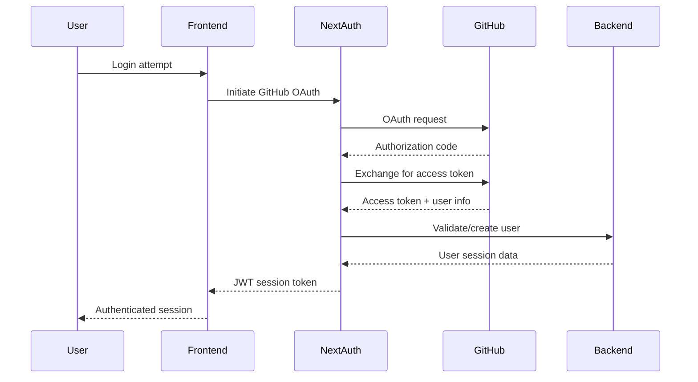

# Backend Architecture

## Service Architecture

### Function Organization

```
backend/
├── src/
│   ├── agents/                 # Agent implementations
│   │   ├── orchestrator/
│   │   │   ├── agent.py
│   │   │   ├── tools.py
│   │   │   └── prompts.py
│   │   ├── developer/
│   │   │   ├── agent.py
│   │   │   ├── tools.py
│   │   │   └── code_generation.py
│   │   └── release/
│   │       ├── agent.py
│   │       ├── tools.py
│   │       └── github_integration.py
│   ├── workflows/              # Temporal workflows
│   │   ├── dev_team_workflow.py
│   │   ├── activities.py
│   │   └── signals.py
│   ├── services/               # Business logic services
│   │   ├── knowledge_service.py
│   │   ├── workflow_service.py
│   │   └── github_service.py
│   ├── api/                    # FastAPI routes
│   │   ├── workflows.py
│   │   ├── knowledge.py
│   │   └── health.py
│   ├── models/                 # Data models
│   │   ├── workflow.py
│   │   ├── knowledge.py
│   │   └── user.py
│   ├── config/                 # Configuration
│   │   ├── settings.py
│   │   └── database.py
│   └── utils/                  # Shared utilities
│       ├── logging.py
│       └── monitoring.py
├── tests/                      # Test suite
└── requirements.txt
```

### Service Template

```python
from fastapi import FastAPI, HTTPException, Depends
from agents import Agent, Runner
from typing import Dict, Any
import logging

logger = logging.getLogger(__name__)

class OrchestratorService:
    def __init__(self):
        self.orchestrator_agent = Agent(
            name="Orchestrator",
            instructions=self._load_orchestrator_instructions(),
            functions=[
                self.query_knowledge,
                self.upsert_knowledge,
                self.start_temporal_workflow,
                self.update_user_status
            ]
        )

    async def process_user_request(self, request: str, user_id: str) -> Dict[str, Any]:
        """Main entry point for user requests."""
        try:
            # Create workflow execution record
            workflow_id = await self._create_workflow_record(request, user_id)

            # Run orchestrator agent
            result = await Runner.run_async(
                self.orchestrator_agent,
                f"User request: {request}",
                session_id=workflow_id
            )

            return {
                "workflow_id": workflow_id,
                "status": "started",
                "agent_response": result.final_output
            }

        except Exception as e:
            logger.error(f"Failed to process user request: {str(e)}")
            raise HTTPException(status_code=500, detail=str(e))

    def query_knowledge(self, query: str, knowledge_type: str = None) -> str:
        """Tool for orchestrator to query vector database."""
        # Implementation connects to Qdrant
        pass

    def upsert_knowledge(self, content: str, metadata: Dict[str, Any]) -> str:
        """Tool for orchestrator to update knowledge base."""
        # Implementation updates Qdrant with new embeddings
        pass
```

## Database Architecture

### Schema Design

See Database Schema section above - PostgreSQL with JSONB for flexible agent context storage.

### Data Access Layer

```python
from sqlalchemy.ext.asyncio import AsyncSession
from sqlalchemy import select, update
from typing import List, Optional
import uuid

class WorkflowRepository:
    def __init__(self, session: AsyncSession):
        self.session = session

    async def create_workflow(self, user_id: str, request: str) -> WorkflowExecution:
        workflow = WorkflowExecution(
            id=str(uuid.uuid4()),
            user_id=user_id,
            request=request,
            status=WorkflowStatus.ANALYZING,
            temporal_workflow_id=f"dev-team-{uuid.uuid4()}"
        )
        self.session.add(workflow)
        await self.session.commit()
        return workflow

    async def update_workflow_status(self, workflow_id: str, status: WorkflowStatus) -> None:
        await self.session.execute(
            update(WorkflowExecution)
            .where(WorkflowExecution.id == workflow_id)
            .values(status=status)
        )
        await self.session.commit()

    async def get_user_workflows(self, user_id: str) -> List[WorkflowExecution]:
        result = await self.session.execute(
            select(WorkflowExecution)
            .where(WorkflowExecution.user_id == user_id)
            .order_by(WorkflowExecution.created_at.desc())
        )
        return result.scalars().all()
```

## Authentication and Authorization

### Auth Flow



### Middleware/Guards

```python
from fastapi import Depends, HTTPException, status
from fastapi.security import HTTPBearer
from jose import JWTError, jwt
import os

security = HTTPBearer()

async def get_current_user(token: str = Depends(security)) -> Dict[str, Any]:
    credentials_exception = HTTPException(
        status_code=status.HTTP_401_UNAUTHORIZED,
        detail="Could not validate credentials",
        headers={"WWW-Authenticate": "Bearer"},
    )

    try:
        payload = jwt.decode(
            token.credentials,
            os.getenv("NEXTAUTH_SECRET"),
            algorithms=["HS256"]
        )
        user_id: str = payload.get("sub")
        if user_id is None:
            raise credentials_exception
        return {"user_id": user_id, "email": payload.get("email")}
    except JWTError:
        raise credentials_exception
```
