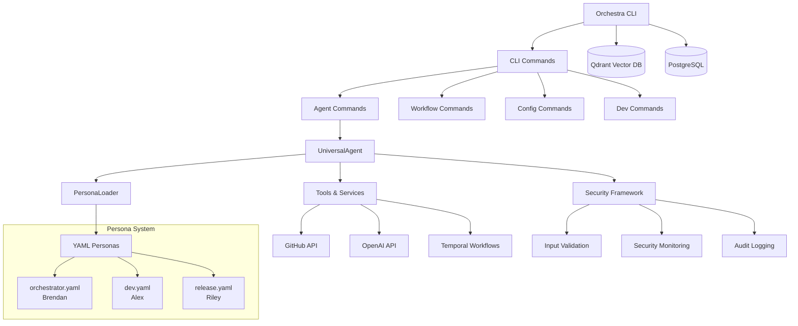

# Component Diagram (Current v0.1.0 Implementation)

## Current Architecture Notes

This diagram shows the **current v0.1.0 implementation**. The system uses:

- **Single UniversalAgent**: Dynamically configured through YAML personas
- **Three Active Personas**: Orchestrator, Developer, and Release specialists
- **Command-Driven Interface**: Each persona defines specific commands and execution patterns
- **Integrated Services**: Temporal, Qdrant, and PostgreSQL for workflow orchestration and data storage
