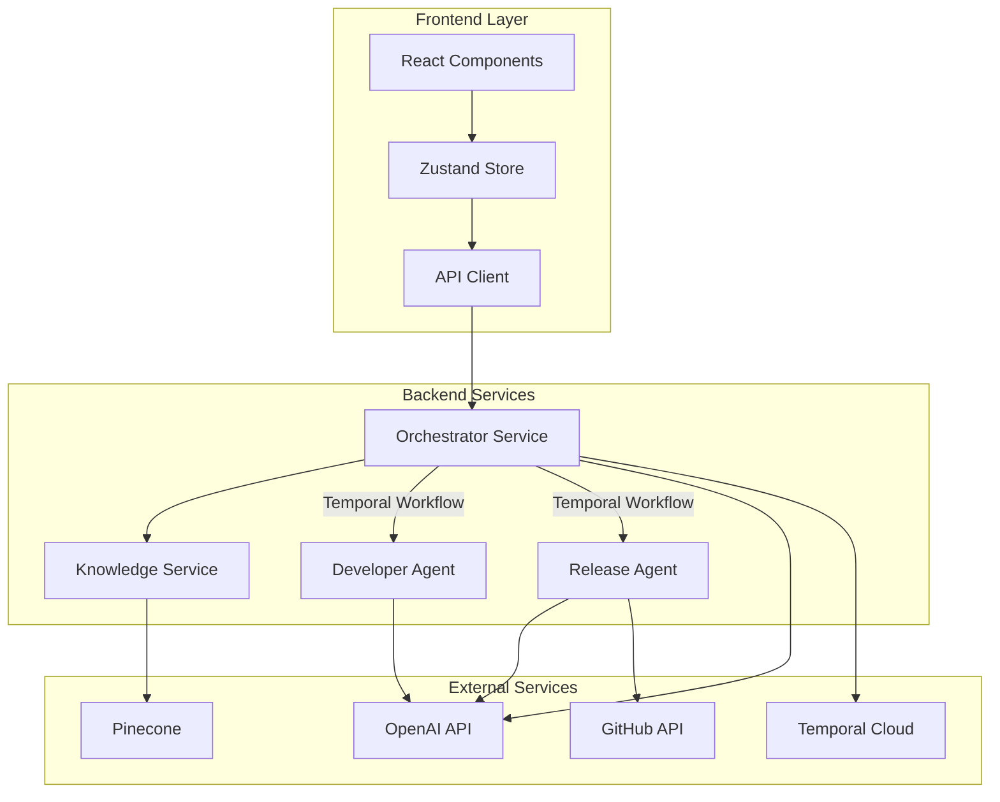

# Components

## Orchestrator Service

**Responsibility:** Central coordination hub managing user interactions, workflow orchestration, and knowledge management

**Key Interfaces:**

- `/api/chat` - User conversation interface
- `/api/workflows` - Workflow management
- `/internal/knowledge` - Vector database operations

**Dependencies:** OpenAI Agents SDK, Temporal Client, Pinecone Client, FastAPI

**Technology Stack:** Python 3.12 + FastAPI + OpenAI Agents SDK + Temporal SDK

## Developer Agent Service

**Responsibility:** Specialized code generation and modification based on implementation plans

**Key Interfaces:**

- Internal handoff from Orchestrator
- Code generation tools
- Repository analysis tools

**Dependencies:** OpenAI API, GitHub API (read-only), Code analysis tools

**Technology Stack:** Python 3.12 + OpenAI Agents SDK + GitHub API client

## Release Agent Service

**Responsibility:** Repository operations, Pull Request creation, and deployment validation

**Key Interfaces:**

- Internal handoff from Orchestrator
- GitHub API operations
- Deployment validation tools

**Dependencies:** GitHub API, CI/CD integration tools, Code quality validators

**Technology Stack:** Python 3.12 + OpenAI Agents SDK + GitHub API client

## Vector Knowledge Service

**Responsibility:** Dynamic project knowledge storage, retrieval, and evolution management

**Key Interfaces:**

- `/knowledge/query` - Semantic search
- `/knowledge/upsert` - Knowledge updates
- `/knowledge/evolution` - Version management

**Dependencies:** Pinecone, OpenAI Embeddings API, PostgreSQL

**Technology Stack:** Python 3.12 + Pinecone + text-embedding-3-large

## Frontend Application

**Responsibility:** User interface for agent interaction, workflow monitoring, and result visualization

**Key Interfaces:**

- Chat interface for user-agent communication
- Workflow status dashboard
- Code review and PR integration views

**Dependencies:** Orchestrator API, Authentication service

**Technology Stack:** Next.js 14 + TypeScript + Tailwind CSS + shadcn/ui

## Component Diagrams

