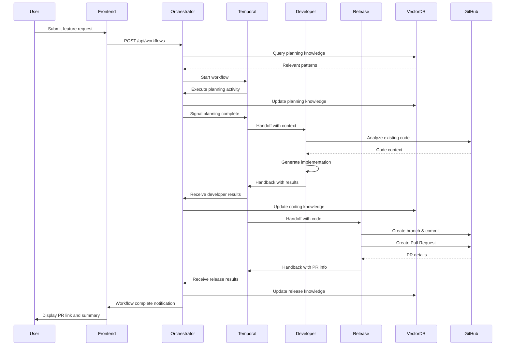

# Core Workflows

```mermaid
sequenceDiagram
    participant User
    participant Frontend
    participant Orchestrator
    participant Temporal
    participant Developer
    participant Release
    participant VectorDB
    participant GitHub

    User->>Frontend: Submit feature request
    Frontend->>Orchestrator: POST /api/workflows

    Orchestrator->>VectorDB: Query planning knowledge
    VectorDB-->>Orchestrator: Relevant patterns

    Orchestrator->>Temporal: Start workflow
    Temporal->>Orchestrator: Execute planning activity

    Orchestrator->>VectorDB: Update planning knowledge
    Orchestrator->>Temporal: Signal planning complete

    Temporal->>Developer: Handoff with context
    Developer->>GitHub: Analyze existing code
    GitHub-->>Developer: Code context

    Developer->>Developer: Generate implementation
    Developer->>Temporal: Handback with results

    Temporal->>Orchestrator: Receive developer results
    Orchestrator->>VectorDB: Update coding knowledge

    Temporal->>Release: Handoff with code
    Release->>GitHub: Create branch & commit
    Release->>GitHub: Create Pull Request
    GitHub-->>Release: PR details

    Release->>Temporal: Handback with PR info
    Temporal->>Orchestrator: Receive release results
    Orchestrator->>VectorDB: Update release knowledge

    Orchestrator->>Frontend: Workflow complete notification
    Frontend->>User: Display PR link and summary
```
