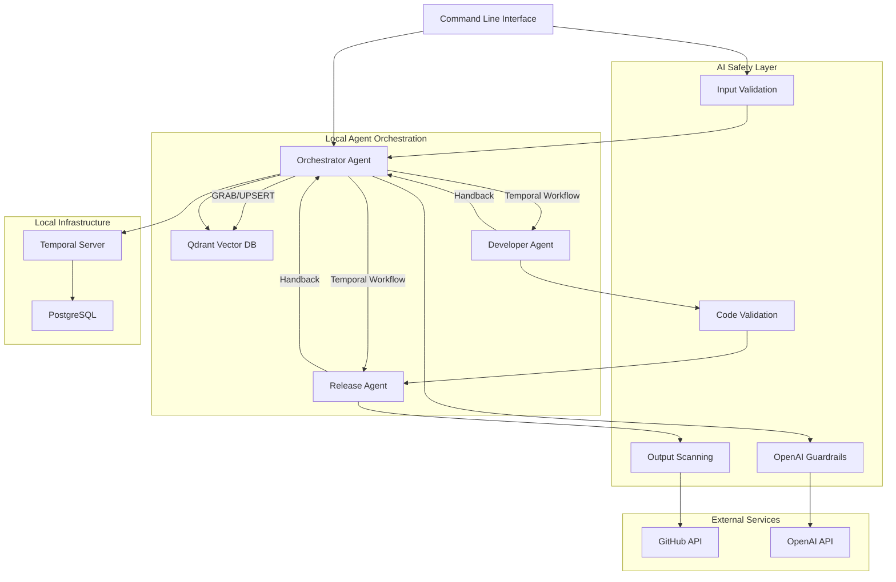

# High Level Architecture

## Technical Summary

The AI Dev Team Orchestrator MVP employs a Python-based CLI architecture where an Orchestrator agent serves as both command-line interface coordinator and workflow manager, delegating to specialized Developer and Release agents through OpenAI SDK handoffs within Temporal workflow orchestration. A dynamic vector database provides evolving project knowledge with comprehensive security validation, while multiple layers of AI safety guardrails ensure secure code generation and repository operations. This streamlined architecture validates the core multi-agent concept through local CLI interaction while implementing production-grade AI safety measures.

## Platform and Infrastructure Choice

**Platform:** Local Development with Essential Cloud Services
**Key Services:** Temporal Local (workflow orchestration), Qdrant (local vector database), Local CLI (user interface)
**Deployment:** Local development environment with cloud service integration for agent orchestration

## Repository Structure

**Structure:** Python Package with Poetry
**Dependency Management:** Poetry for Python dependencies and virtual environment
**Package Organization:** Agent modules, workflow definitions, CLI interface, and shared utilities with security validators

## High Level Architecture Diagram

## Architectural Patterns

- **Command Pattern:** CLI commands trigger specific agent workflow patterns - _Rationale:_ Clean separation between user interface and agent coordination logic
- **Event-Driven Agent Orchestration:** Temporal workflows coordinate agent handoffs through durable event sequences - _Rationale:_ Enables fault-tolerant multi-agent coordination with automatic state recovery
- **Centralized Knowledge Management:** Single Orchestrator manages all vector database operations with safety validation - _Rationale:_ Eliminates concurrent update conflicts and ensures knowledge security
- **Defense in Depth:** Multiple security layers (input validation, guardrails, output scanning, access controls) - _Rationale:_ Comprehensive protection against AI security vulnerabilities
- **Repository Pattern:** Abstract external service access with security wrappers - _Rationale:_ Enables secure testing, monitoring, and future service migrations
