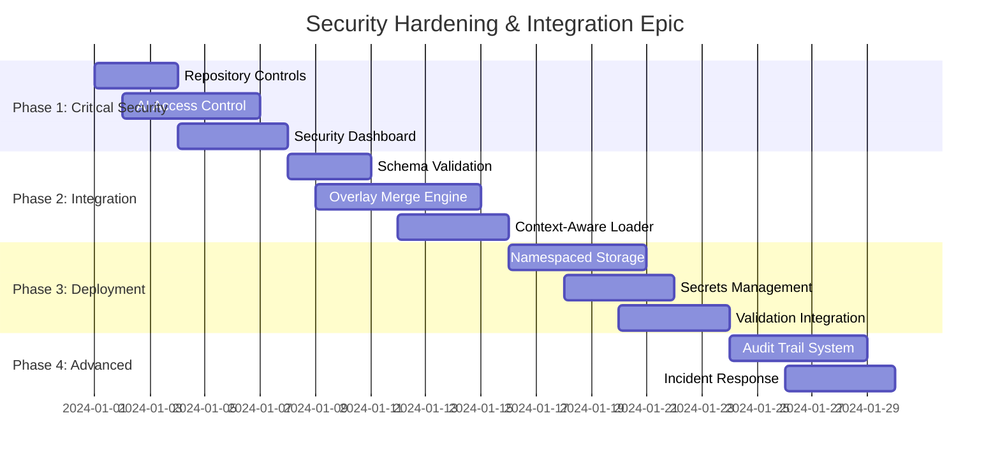

# Epic 6: Security Hardening & Integration Readiness

**Epic Goal:** Address critical security gaps (15% → 85% compliance) and complete integration work to enable safe autonomous AI agent operations.

## Implementation Status: 🚧 **ACTIVE DEVELOPMENT**

Epic 6 is currently being developed to address critical security gaps and enable safe autonomous AI agent operations.

## Executive Summary

**Current State**: Orchestra has solid security frameworks but lacks operational deployment and integration between components. AI agents can currently bypass security controls.

**Target State**: Production-ready security posture with integrated resource systems, enabling autonomous AI agents to operate safely with proper oversight.

**Priority**: **CRITICAL** - Required before autonomous AI agent deployment

---

## 📊 Current Security Assessment

- **Security Compliance**: 15% → Target: 85%
- **Integration Status**: Core components exist but not integrated
- **Risk Level**: HIGH - AI agents can bypass controls
- **Operational Readiness**: LOW - Missing deployment automation

---

## 🎯 Stories Breakdown

### Phase 1: Critical Security Hardening (Week 1-2)

#### **Story 6.1: Repository Security Controls**
**Priority**: P0 - CRITICAL
**Effort**: 2-3 days

**Acceptance Criteria:**
- [ ] Enable GitHub branch protection on `main` and `develop` branches
- [ ] Require status checks: security scans, tests, code quality
- [ ] Require pull request reviews for all changes
- [ ] Remove `continue-on-error: true` from mypy in CI
- [ ] Block direct pushes to protected branches

**Implementation:**
```bash
# GitHub CLI setup for branch protection
gh api repos/:owner/:repo/branches/main/protection \
  --method PUT \
  --field required_status_checks='{"strict":true,"contexts":["security","tests","quality"]}' \
  --field enforce_admins=true \
  --field required_pull_request_reviews='{"required_approving_review_count":1}'
```

#### **Story 6.2: AI Agent Access Control System**
**Priority**: P0 - CRITICAL
**Effort**: 4-5 days

**Acceptance Criteria:**
- [ ] Create separate GitHub tokens for AI agent operations
- [ ] Implement AI agent permission matrix (read/write/admin by resource)
- [ ] Add AI agent identification in all API calls
- [ ] Create audit trail for AI vs human actions
- [ ] Implement least-privilege access controls

**Technical Approach:**
```python
class AIAgentAccessControl:
    def __init__(self, agent_id: str, permissions: Dict[str, List[str]]):
        self.agent_id = agent_id
        self.permissions = permissions

    def check_permission(self, resource: str, action: str) -> bool:
        return action in self.permissions.get(resource, [])

    @audit_trail
    def execute_action(self, resource: str, action: str, context: Dict):
        if not self.check_permission(resource, action):
            raise PermissionDeniedError(f"AI agent {self.agent_id} denied {action} on {resource}")
```

#### **Story 6.3: Security Monitoring Dashboard**
**Priority**: P1 - HIGH
**Effort**: 3-4 days

**Acceptance Criteria:**
- [ ] Deploy security metrics collection
- [ ] Create real-time security dashboard
- [ ] Implement alerting for security violations
- [ ] Add AI agent behavior monitoring
- [ ] Create security incident response automation

### Phase 2: Resource System Integration (Week 3-4)

#### **Story 6.4: Schema Validation Integration**
**Priority**: P1 - HIGH
**Effort**: 2-3 days

**Current Gap**: Resource engines exist but no CI schema validation

**Acceptance Criteria:**
- [ ] Create JSON schemas for all resource types (tasks, templates, checklists)
- [ ] Add schema validation to CI pipeline
- [ ] Implement schema validation in ResourceLoader
- [ ] Add helpful error messages for schema violations
- [ ] Create schema documentation

**Implementation:**
```yaml
# .github/workflows/ci.yml addition
- name: Validate Resource Schemas
  run: |
    poetry run python scripts/validate-schemas.py
    poetry run jsonschema -i resources/tasks/*.yaml schemas/task.schema.json
```

#### **Story 6.5: Persona Overlay Merge Engine**
**Priority**: P1 - HIGH
**Effort**: 5-6 days

**Current Gap**: Overlay system documented but not implemented

**Acceptance Criteria:**
- [ ] Implement deterministic overlay merge: base → team → project
- [ ] Add conflict detection and resolution
- [ ] Create merge trace logging
- [ ] Implement hot-reload with cache invalidation
- [ ] Add merge preview and diff capabilities

**Technical Approach:**
```python
class PersonaOverlayMerger:
    def merge_persona(self, persona_id: str, team_id: str = None, project_id: str = None) -> PersonaSpec:
        base = self.load_base_persona(persona_id)
        team_overlay = self.load_team_overlay(persona_id, team_id) if team_id else {}
        project_overlay = self.load_project_overlay(persona_id, project_id) if project_id else {}

        merged = self.deep_merge([base, team_overlay, project_overlay])
        self.log_merge_trace(persona_id, team_id, project_id, merged)
        return merged
```

#### **Story 6.6: Context-Aware Loader API**
**Priority**: P1 - HIGH
**Effort**: 3-4 days

**Current Gap**: Multi-project loader API missing

**Acceptance Criteria:**
- [ ] Implement `load_persona(pid, team_id, project_id)` API
- [ ] Add structured error handling and retries
- [ ] Implement cache invalidation strategies
- [ ] Add performance monitoring and metrics
- [ ] Create API documentation and examples

### Phase 3: Operational Security Deployment (Week 5-6)

#### **Story 6.7: Namespaced Storage Implementation**
**Priority**: P2 - MEDIUM
**Effort**: 4-5 days

**Current Gap**: Qdrant per-project collections not implemented

**Acceptance Criteria:**
- [ ] Implement Qdrant collection per project: `orchestra_{project_id}`
- [ ] Create PostgreSQL schema per project
- [ ] Add namespace isolation tests
- [ ] Implement project initialization scripts
- [ ] Add cross-project access controls

#### **Story 6.8: Security Secrets Management**
**Priority**: P2 - MEDIUM
**Effort**: 3-4 days

**Acceptance Criteria:**
- [ ] Deploy secrets management solution (Azure Key Vault/AWS Secrets Manager)
- [ ] Migrate all API keys to secrets manager
- [ ] Implement secrets rotation automation
- [ ] Add secrets scanning in CI/CD
- [ ] Create secrets access audit trail

#### **Story 6.9: Input/Output Validation Integration**
**Priority**: P2 - MEDIUM
**Effort**: 3-4 days

**Current Gap**: Security validation classes exist but not integrated

**Acceptance Criteria:**
- [ ] Integrate AIAgentValidator with all agent operations
- [ ] Deploy output scanning for generated code
- [ ] Add input sanitization for all AI requests
- [ ] Implement violation blocking and reporting
- [ ] Create validation performance benchmarks

### Phase 4: Advanced Security Features (Week 7-8)

#### **Story 6.10: AI Agent Audit Trail System**
**Priority**: P2 - MEDIUM
**Effort**: 4-5 days

**Acceptance Criteria:**
- [ ] Implement comprehensive AI agent action logging
- [ ] Create audit trail search and filtering
- [ ] Add correlation IDs for multi-agent operations
- [ ] Implement audit trail retention policies
- [ ] Create compliance reporting dashboard

#### **Story 6.11: Security Incident Response Automation**
**Priority**: P3 - NICE TO HAVE
**Effort**: 3-4 days

**Acceptance Criteria:**
- [ ] Implement automated AI agent isolation on violations
- [ ] Create incident response playbooks
- [ ] Add automated rollback for security violations
- [ ] Implement security alert escalation
- [ ] Create post-incident analysis automation

---

## 🎯 Success Criteria & Metrics

### Security Compliance Targets
- [ ] **85% security compliance** (up from 15%)
- [ ] **0% security scan bypass rate** - All failing scans block deployment
- [ ] **100% AI agent action logging** - Complete audit trail
- [ ] **<5 minute** security incident detection time
- [ ] **0 critical vulnerabilities** in production

### Integration Targets
- [ ] **<500ms persona load time** with overlays
- [ ] **100% schema validation** on all resources
- [ ] **Support for 16+ personas** across multiple projects
- [ ] **Zero integration test failures** for resource systems

### Operational Targets
- [ ] **Automated security deployment** via CI/CD
- [ ] **24/7 security monitoring** with alerting
- [ ] **Documented incident response** procedures
- [ ] **Regular security assessment** automation

---

## 🚀 Implementation Timeline



**Total Effort**: 6-8 weeks
**Team Size**: 2-3 developers
**Dependencies**: GitHub admin access, cloud secrets management setup

---

## 🔍 Risk Assessment

### High Risks
- **Operational Disruption**: Security changes may break existing workflows
  - *Mitigation*: Gradual rollout with feature flags
- **Performance Impact**: Additional security layers may slow operations
  - *Mitigation*: Performance benchmarking and optimization
- **Integration Complexity**: Multiple systems need coordination
  - *Mitigation*: Comprehensive integration testing

### Medium Risks
- **Team Learning Curve**: New security tools and processes
  - *Mitigation*: Documentation and training sessions
- **Third-party Dependencies**: Secrets management, monitoring tools
  - *Mitigation*: Vendor evaluation and backup plans

---

## 📚 Dependencies & Prerequisites

### Technical Prerequisites
- [ ] GitHub admin access for branch protection setup
- [ ] Cloud provider access for secrets management
- [ ] Monitoring/alerting platform selection
- [ ] Security scanning tool licenses

### Team Prerequisites
- [ ] Security engineering expertise
- [ ] Integration testing capabilities
- [ ] DevOps automation skills
- [ ] Incident response procedures

---

## 🎖️ Definition of Done

**Epic Complete When**:
- [ ] All P0 and P1 stories delivered and tested
- [ ] Security compliance reaches 85%+
- [ ] All QA gates show "APPROVED" status
- [ ] Integration tests pass for autonomous agent scenarios
- [ ] Security incident response tested and documented
- [ ] Production deployment completed with monitoring

**Ready for Autonomous AI Agents When**:
- [ ] AI agents cannot bypass security controls
- [ ] Complete audit trail for all AI actions
- [ ] Automated incident response operational
- [ ] Multi-project isolation verified
- [ ] Performance targets met under load

---

This epic addresses the critical gap between "working prototypes" and "production-ready autonomous AI agents." Upon completion, Orchestra will be ready for the ambitious autonomous workflow scenarios you described.
