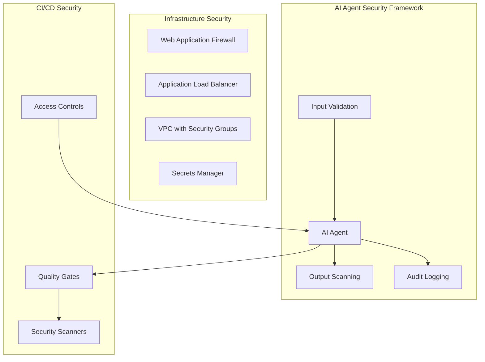

# Orchestra Infrastructure Security Plan

**Document Version:** 1.0  
**Created:** December 2024  
**Author:** Alex (DevOps Infrastructure Specialist)  
**Status:** CRITICAL - Immediate Implementation Required

---

## 🚨 Executive Summary

Based on comprehensive infrastructure assessment, Orchestra AI Agent System currently has **CRITICAL SECURITY GAPS** that allow AI agents to bypass all security controls. **Current Security Compliance: 15%**.

**IMMEDIATE RISK:** AI agents can commit failing security scans, broken code, and vulnerable applications due to non-blocking CI/CD security gates.

---

## 🔴 CRITICAL SECURITY ISSUES (Fix This Week)

### 1. Non-Blocking Security Scans

**Current State:** All security scans have `continue-on-error: true` in GitHub Actions
**Risk:** AI agents can commit code that fails security scans
**Impact:** Critical security vulnerabilities in production

**IMMEDIATE FIX:**

```yaml
# .github/workflows/ci.yml - REMOVE continue-on-error
- name: Run Security Scans
  run: |
    poetry run bandit -r src/ -c bandit.yaml
    poetry run safety check
  # REMOVE: continue-on-error: true
```

### 2. Missing Branch Protection Rules

**Current State:** No branch protection on main/develop branches
**Risk:** AI agents can commit directly to protected branches
**Impact:** Bypassed code review and quality gates

**IMMEDIATE FIX:**

```bash
# Enable branch protection via GitHub API or UI
# Required status checks:
# - Security scans
# - Test suite
# - Code quality checks
```

### 3. No AI Agent Access Controls

**Current State:** No differentiated permissions for AI vs human operations
**Risk:** AI agents have same broad permissions as humans
**Impact:** AI agents can access/modify anything

**IMMEDIATE FIX:**

- Create separate GitHub tokens for AI agent operations
- Implement least privilege access for AI workflows
- Add audit logging for AI agent actions

---

## 🛡️ SECURITY IMPLEMENTATION ROADMAP

### Week 1: Critical Security Gates

- [ ] **Make all security scans blocking** (remove `continue-on-error`)
- [ ] **Enable GitHub branch protection** with required status checks
- [ ] **Add pre-commit security hooks** that block local commits on failures
- [ ] **Create AI agent access control matrix**
- [ ] **Implement basic security monitoring**

### Week 2-4: Access Controls & Monitoring

- [ ] **Deploy RBAC for AI agents** with least privilege principles
- [ ] **Add security audit logging** for all AI agent actions
- [ ] **Implement input validation** for AI-generated content
- [ ] **Create security alert system** for suspicious AI behavior
- [ ] **Add secrets rotation strategy**

### Month 2-3: Comprehensive Security Framework

- [ ] **Deploy secrets management solution** (AWS Secrets Manager/Azure Key Vault)
- [ ] **Implement security scanning** for infrastructure as code
- [ ] **Add compliance monitoring** and reporting
- [ ] **Deploy container security scanning** in CI/CD pipeline
- [ ] **Implement network security policies**

---

## 🔐 AI AGENT SPECIFIC SECURITY CONTROLS

### Input Validation

```python
# Example: AI Agent Input Sanitization
class AIAgentInputValidator:
    def validate_code_generation_request(self, request: str) -> bool:
        # Block requests for sensitive operations
        forbidden_patterns = [
            r'rm -rf',
            r'DROP TABLE',
            r'DELETE FROM.*WHERE.*=.*',
            r'sudo.*',
            r'curl.*\|.*sh'
        ]
        return not any(re.search(pattern, request, re.IGNORECASE)
                      for pattern in forbidden_patterns)
```

### Output Scanning

```python
# Example: AI Agent Output Validation
class AIAgentOutputScanner:
    def scan_generated_code(self, code: str) -> SecurityScanResult:
        # Scan for hardcoded secrets
        secret_patterns = [
            r'sk-[a-zA-Z0-9]{48}',  # OpenAI API keys
            r'ghp_[a-zA-Z0-9]{36}', # GitHub tokens
            r'AKIA[0-9A-Z]{16}'     # AWS access keys
        ]

        violations = []
        for pattern in secret_patterns:
            if re.search(pattern, code):
                violations.append(f"Potential secret detected: {pattern}")

        return SecurityScanResult(violations)
```

### AI Agent Audit Trail

```python
# Example: AI Agent Action Logging
@audit_log
def ai_agent_action(agent_id: str, action: str, target: str):
    audit_logger.log({
        "timestamp": datetime.utcnow(),
        "agent_id": agent_id,
        "action": action,
        "target": target,
        "user_context": get_user_context(),
        "risk_level": assess_action_risk(action, target)
    })
```

---

## 🏗️ INFRASTRUCTURE SECURITY ARCHITECTURE

### Security Layers



### Security Zones

1. **Public Zone:** Load balancers, CDN
2. **Application Zone:** AI agents, web services
3. **Data Zone:** Databases, sensitive data
4. **Management Zone:** CI/CD, monitoring

---

## 📊 SECURITY MONITORING & ALERTING

### Critical Security Metrics

- AI agent authentication failures
- Failed security scan attempts
- Unusual API usage patterns
- Privilege escalation attempts
- Data access violations

### Alert Thresholds

```yaml
security_alerts:
  ai_agent_failures:
    threshold: 5 failures in 10 minutes
    action: Block AI agent, alert security team

  security_scan_failures:
    threshold: 1 failure
    action: Block deployment, require manual review

  unusual_access_patterns:
    threshold: Access outside normal hours
    action: Alert and log for investigation
```

---

## 🛠️ IMPLEMENTATION CHECKLIST

### Immediate (Week 1)

- [ ] Remove `continue-on-error: true` from all CI security scans
- [ ] Enable GitHub branch protection with required status checks
- [ ] Create separate GitHub tokens for AI agent operations
- [ ] Add basic security monitoring dashboard
- [ ] Document AI agent security policies

### Short-term (Month 1)

- [ ] Deploy comprehensive input/output validation
- [ ] Implement AI agent audit logging
- [ ] Add secrets management solution
- [ ] Create security incident response procedures
- [ ] Deploy container security scanning

### Medium-term (Month 2-3)

- [ ] Achieve 80%+ security compliance
- [ ] Deploy comprehensive monitoring platform
- [ ] Implement zero-trust security model
- [ ] Complete security governance framework
- [ ] Conduct penetration testing

---

## 🎯 SECURITY VALIDATION & TESTING

### Security Testing Strategy

```bash
# Example: Automated Security Testing
# 1. SAST (Static Application Security Testing)
poetry run bandit -r src/ -f json

# 2. DAST (Dynamic Application Security Testing)
zap-baseline.py -t http://localhost:8000

# 3. Container Security
docker run --rm -v /var/run/docker.sock:/var/run/docker.sock \
  aquasec/trivy image orchestra:latest

# 4. Infrastructure Security
checkov -d . --framework terraform
```

### Penetration Testing Checklist

- [ ] AI agent input injection testing
- [ ] Authentication and authorization testing
- [ ] API security testing
- [ ] Container escape testing
- [ ] Network segmentation validation

---

## ⚖️ COMPLIANCE & GOVERNANCE

### Regulatory Considerations

- **SOC 2 Type II:** Security controls documentation and effectiveness
- **ISO 27001:** Information security management system
- **GDPR:** Data protection for AI agent data processing
- **EU AI Act:** AI system risk management and security

### Security Policies Required

1. AI Agent Security Policy
2. Data Classification Policy
3. Access Control Policy
4. Incident Response Policy
5. Security Monitoring Policy

---

## 📋 SUCCESS CRITERIA

### Security Objectives

- [ ] **0% security scan bypass rate** - All failing scans block deployment
- [ ] **100% AI agent action logging** - Complete audit trail
- [ ] **<5 minute** security incident detection time
- [ ] **80%+ security compliance** across all infrastructure components
- [ ] **0 critical vulnerabilities** in production

### Key Performance Indicators

- Security scan failure rate: <1%
- Mean time to detect security incidents: <5 minutes
- Mean time to resolve security incidents: <30 minutes
- AI agent security violation rate: <0.1%
- Security policy compliance: >95%

---

## 🚨 EMERGENCY PROCEDURES

### Security Incident Response

1. **Detect** - Automated monitoring alerts
2. **Assess** - Security team evaluates severity
3. **Contain** - Isolate affected systems
4. **Eradicate** - Remove security threats
5. **Recover** - Restore secure operations
6. **Learn** - Post-incident review and improvements

### AI Agent Security Breach Response

1. Immediately disable affected AI agent
2. Audit all recent AI agent actions
3. Assess scope of potential damage
4. Rollback any suspicious changes
5. Strengthen controls before re-enabling

---

**CRITICAL: This security plan addresses immediate risks identified in comprehensive infrastructure assessment. Implementation of Week 1 items is required before AI agents should be used in production environments.**

---

_This document will be updated as security controls are implemented and new threats are identified._
